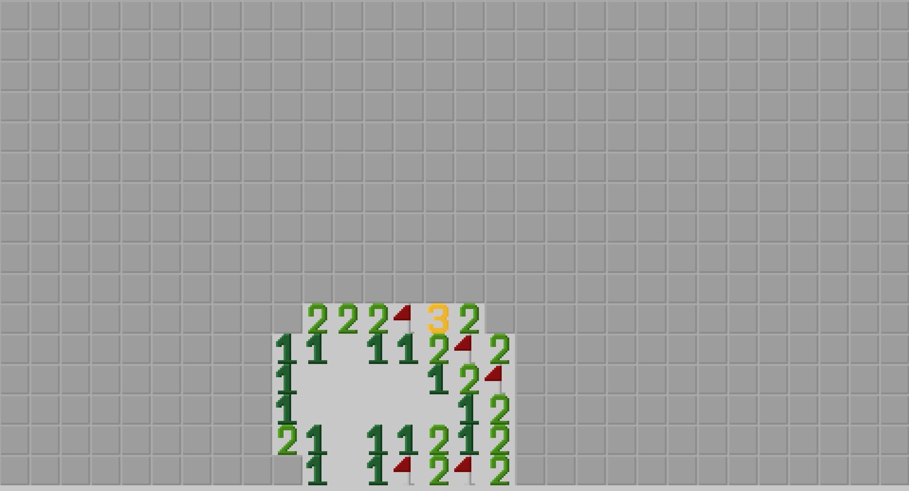
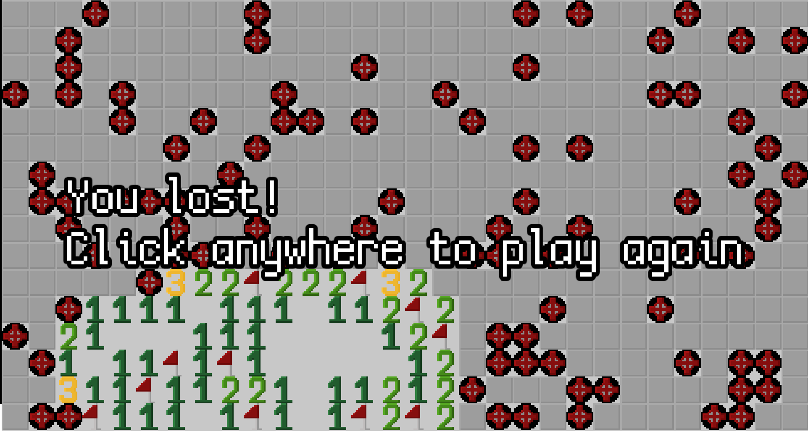

# Minesweeper 

# Building
Run `./conf.sh` first to configure cmake.   
Then run `./run.sh <optional flags>` to compile and run the project. 

# Usage
You can run the project with following flags:   
- `-w <width>` - set the width of grid (`-w 30` is the default.)
- `-h <height>` - set the width of grid (`-h 16` is the default.)
- `-m <mine count>` - set the amount of mines on the grid (`-m 99` is the default.) 

# Credits
[@DrErizo](https://www.github.com/drerizo) helped me with audio and textures :thumbsup:
